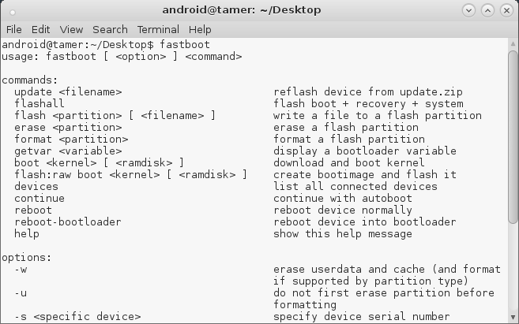

## fastboot

### Overview

Android device has 3 important partitions:

	- Boot loader
	- Recovery
	- Android ROM 

Boot loader loads first and decides the next partition to be loaded (which is usually the *Android ROM*). Recovery is the mode that is used by device to install updates to Android ROM partition. It is also used while factory resetting the phone. The recovery that comes by default usually has less options and that is why custom recovery modules are available.

Fastboot on the other hand is a protocol that can be used to connect to the device from a computer over USB and issue updates to the partitions of the device. For example, while I'm in fastboot I can update by recovery partition.

From [kingoapp.com](http://www.kingoapp.com/help/fastboot-mode.htm), fastboot is defined as:

> Fastboot is a protocol that can be used to re-flash partitions on your device (update the flash file system in Android devices). It is this small tool that comes with the Android SDK (Software Developer Kit), which is an alternative to the Recovery Mode for doing installations and updates.

> Not all phones have a fastboot mode that the user can access. It’s turned on with Nexus devices by default as well as a few other phones and tablets and has been enabled by independent Android developers and enthusiasts on some other phones.

### What is Fastboot for?

While in fastboot, you can *modify the file system images* from a computer over a USB connection. Fastboot mode can start on your device even before Android loads, even under the circumstance when Android isn’t installed at all. And because of that, fastboot mode is useful for quick-updating the firmware, without having to use a recovery mode.

You can read more about the basic commands of fastboot [here](../../Examples/fastboot.md).

### Is fastboot the same as adb ?

Even though both `fastboot` and `adb` send terminal commands to phone from computer via USB, they both serve different functions. Both the tools come with the huge Android SDK but Google recently made a standalone version of these tools available to the users. 

Some basic differences between fastboot and adb :

- fastboot is used to modify phone’s firmware and sends commands directly to the bootloader, whereas, adb sends commands to the phone after it is turned on and booted (or in recovery mode)
- fastboot works without the debugging mode enabled, whereas, adb requires Debugging enabled on the phone
- fastboot isn't available for all devices whereas adb can be used with almost all devices

### fastboot in AndroidTamer

> **Usage :** 

> **android@tamer:~$** `fastboot [ <option> ] <command>`